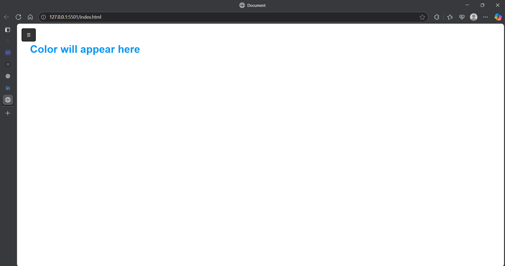
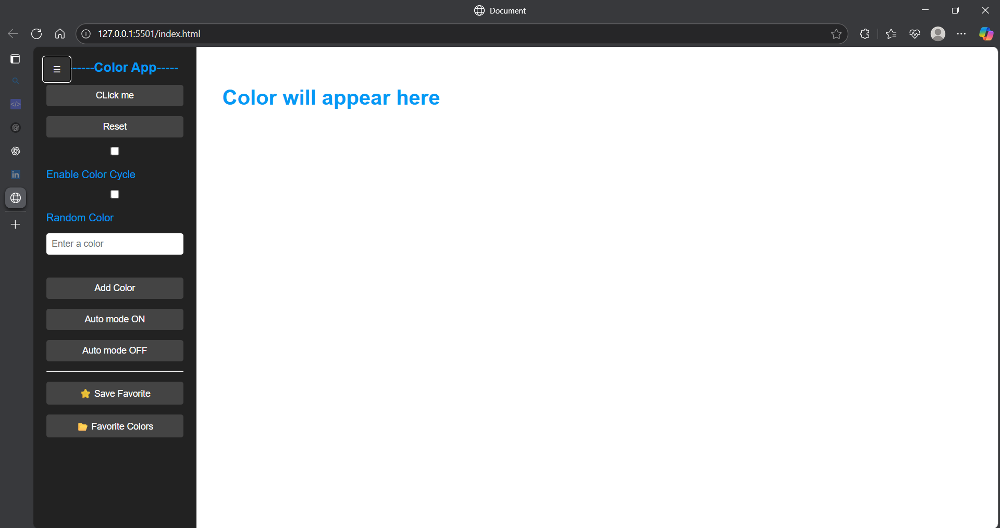
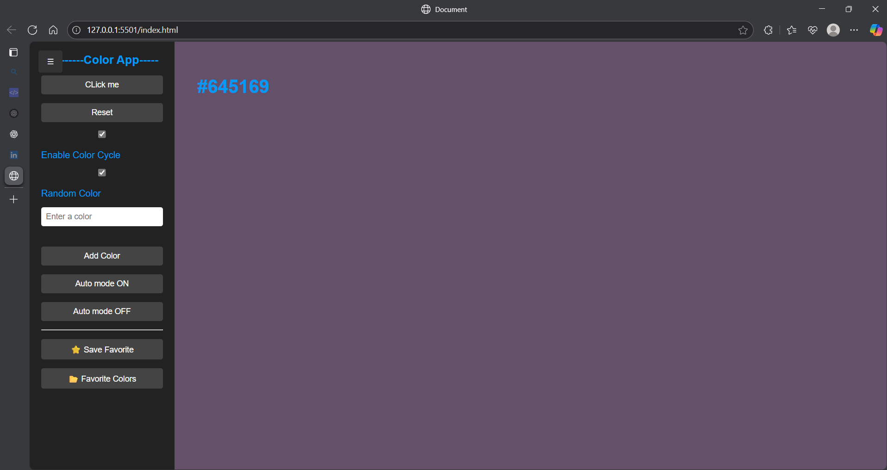

# 🎨 Color Changer App

A simple and interactive web app that lets you change background colors dynamically.  
Features a responsive sidebar for controls and a clean, mobile-friendly design.

## 🚀 Features
- 🎨 **Instant Color Change** – Click to switch to a random or selected color.
- 🪟 **Toggle Sidebar** – Show/hide the sidebar with a single click.
- 💾 **Local Storage Support** – Remembers your last selected color.
- ⚡ **Smooth Transitions** – Clean animations for sidebar and content.

## 📷 Screenshots

### Desktop View (Sidebar Closed)

### Desktop View (Sidebar Open)

### Project in action(random number)

## 🌐 Live Demo
[Click here to view the app](https://your-live-link.com)

## 🛠 Tech Stack
- **HTML5**
- **CSS3**
- **JavaScript (ES6+)**

## 📂 How to Run Locally

# Clone the repository
git clone https://github.com/yourusername/color-changer-app.git

# Open index.html in your browser